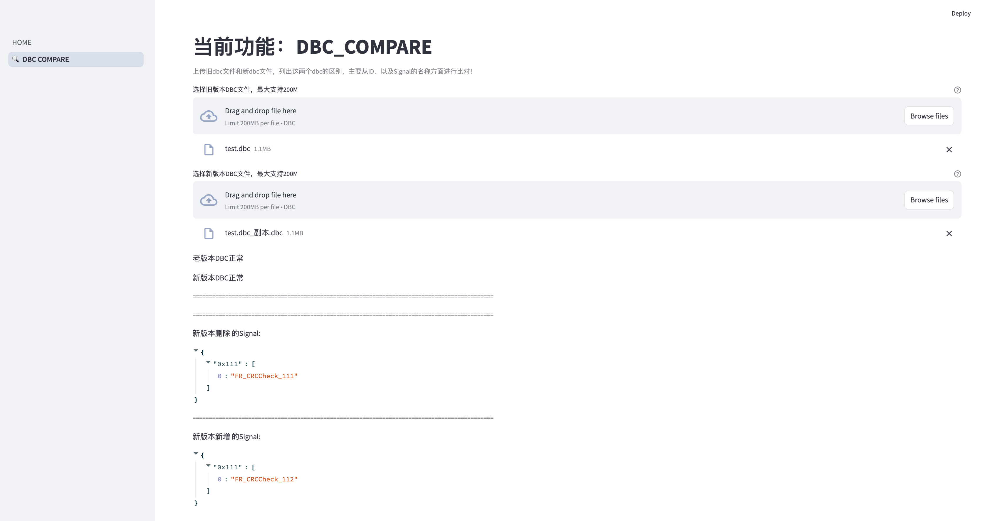

# CompareDBCByMessageSignalName / DBC消息信号名比对工具


[](LICENSE)
[](#)
[](#)


---

## Project Introduction / 项目简介
> **Compare DBC By Message and Signal Name**  
> A lightweight tool for detecting message/signal name changes between two DBC versions.  
> **DBC消息与信号名比对工具**  
> 轻量化检测两个版本DBC文件中消息（Message）和信号（Signal）名称变更的工具，支持CAN总线协议开发场景


---

## Key Features / 主要特性
### 1. **Message Change Tracking**  
   - Lists added/deleted Messages with ID and name  
   - 列出新增/删除的消息（包含ID和名称）  
      *(Supports 1000+ messages comparison per second)

### 2. **Signal Change Analysis**  
   - Identifies signal additions/removals under same message  
   - 识别同一消息下的信号增删  
      *(Auto-mapping messages by ID for precise comparison)

### 3. **Web-Based GUI**  
   - Built with Streamlit for intuitive visualization  
   - 基于Streamlit的网页端可视化界面  
      *(Supports LAN deployment for team collaboration)


---

## Quick Start / 快速开始
### Installation / 安装依赖
```bash
pip install -r requirements.txt  # Requires Python 3.8+
```

### Execution / 运行程序
```python
streamlit run 1_HOME.py  # 默认启动在 http://localhost:8501
```
### Implementation Demo / 效果演示
Message / Signal Comparison Report


## License / 许可证
MIT Licensed. See [LICENSE](LICENSE) for details.
MIT 许可证，详见[LICENSE](LICENSE)文件。